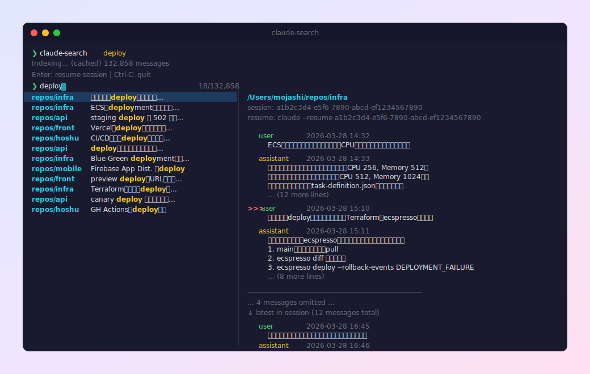

# claude-fulltext-search

Full-text search for [Claude Code](https://claude.ai/claude-code) chat history with fzf-powered TUI.

## Install

```sh
curl -fsSL https://raw.githubusercontent.com/Mojashi/claude-fulltext-search/main/install.sh | sh
```



## Features

- Full-text search across all Claude Code conversations (including tool use / tool results)
- fzf-powered interactive fuzzy finder with conversation preview (with query highlighting)
- Preview shows latest messages in the session at a glance
- Filter by project path or message role
- Resume sessions directly from search results (auto `cd` to the correct directory)
- Configurable exec command on selection (`--setup`)
- Incremental index caching for fast repeated searches
- Auto-downloads fzf if not installed
- Self-update from GitHub releases

Or specify a custom install directory:

```sh
INSTALL_DIR=~/.local/bin curl -fsSL https://raw.githubusercontent.com/Mojashi/claude-fulltext-search/main/install.sh | sh
```

### Build from source

Requires [Bun](https://bun.sh/).

```bash
git clone https://github.com/Mojashi/claude-fulltext-search.git
cd claude-fulltext-search
bun build --compile index.ts --outfile claude-search
mv claude-search ~/.local/bin/
```

### Update

```bash
claude-search --update
```

## Usage

```bash
# Search all conversations
claude-search

# Search with initial query
claude-search "docker compose"

# Filter by project directory (resolves path, includes subdirectories)
claude-search -p .
claude-search -p ~/repos/my-project

# Filter by role
claude-search -r user
claude-search -r assistant

# Custom command on selection
claude-search -e 'echo {sessionId}'

# List all projects
claude-search --list-projects

# Configure settings (exec template, etc.)
claude-search --setup

# Clear index cache
claude-search --clear-cache
```

### Key bindings (in fzf)

- Type to filter results
- Up/Down to navigate
- Enter to resume the selected session
- Ctrl-C to quit
- Prefix with `'` for exact match (e.g. `'mutool`)

## How it works

Claude Code stores conversation history as JSONL files in `~/.claude/projects/`. This tool:

1. Indexes all messages (text, tool use inputs, tool results) from every session
2. Caches the index incrementally — only re-reads files that changed or grew
3. Pipes the index to fzf for interactive filtering with a conversation preview panel
4. On selection, `cd`s to the original project directory and runs the configured command (default: `claude --resume <session-id>`)

## License

MIT
